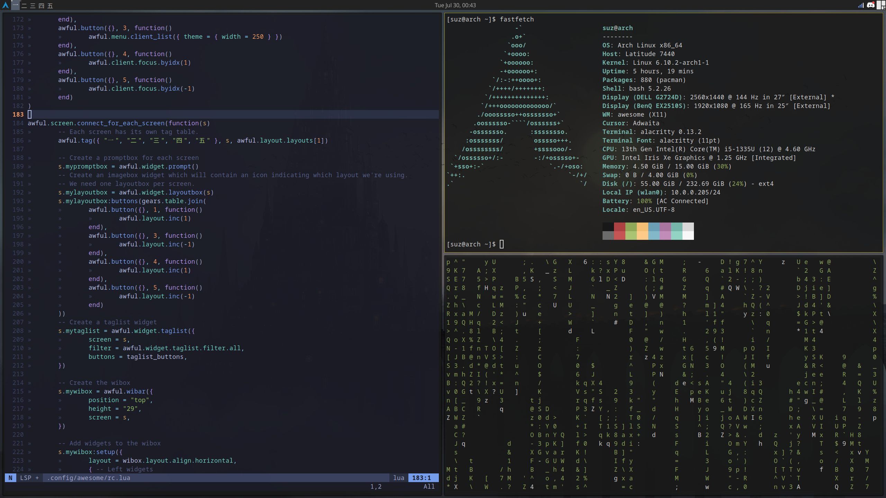

# DotFiles

Welcome to my collection of dotfiles, where I have customized and riced my Linux setups. This repository includes configurations primarily for window managers, Xmonad and AwesomeWM (till now!), and other applications.

## Table of Contents

- [Introduction](#introduction)
- [Installation](#installation)
- [Usage](#usage)
- [Screenshots](#screenshots)

## Installation

To use these dotfiles, follow the steps below:

### Prerequisites

- Ensure you have the necessary dependencies installed, such as `xmonad`, `xmonad-contrib`, `awesome`, and other required utilities.

### Clone the Repository

```bash
git clone https://github.com/Motaphe/dotFiles.git
cd dotFiles/.config/
```

### Setup for Xmonad

1. Backup your current Xmonad configuration:
    ```bash
    mv ~/.xmonad ~/.xmonad.backup
    ```

2. Symlink the Xmonad configuration:
    ```bash
    ln -s ~/dotFiles/xmonad ~/.xmonad
    ```

### Setup for AwesomeWM

1. Backup your current AwesomeWM configuration:
    ```bash
    mv ~/.config/awesome ~/.config/awesome.backup
    ```

2. Symlink the AwesomeWM configuration:
    ```bash
    ln -s ~/dotFiles/awesome ~/.config/awesome
    ```

## Usage

- **Xmonad**: Start or restart Xmonad with your custom configuration by running:
    ```bash
    xmonad --recompile && xmonad --restart
    ```

- **AwesomeWM**: Start or restart AwesomeWM with your custom configuration by running:
    ```bash
    awesome -k && awesome --restart
    ```

## Screenshots

Here is a snapshot of my AwesomeWM rice:


